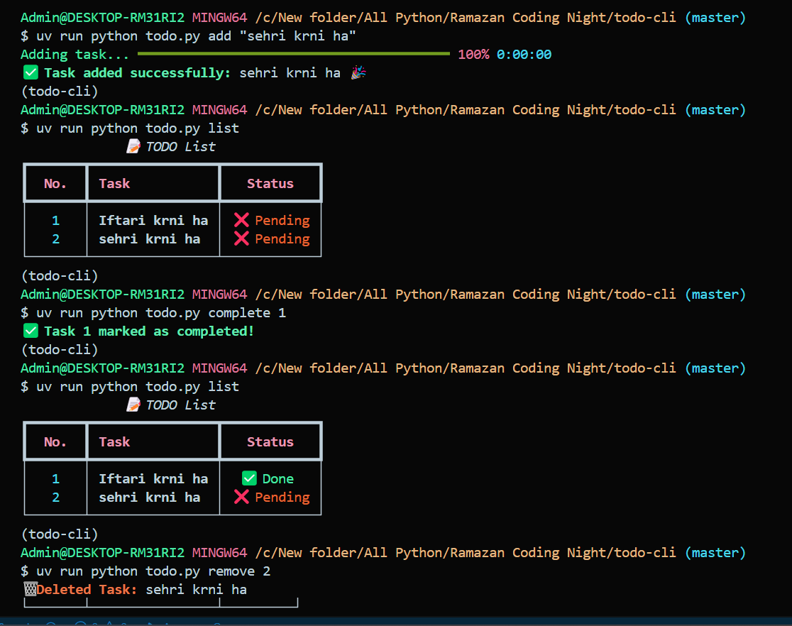

# 📝 CLI TODO App

A simple, fast, and beautiful command-line **TODO list manager** built with **Python**, **Click**, and **Rich**.

## 🚀 Features
- ✅ **Add tasks** with a smooth progress animation
- 📋 **View tasks** in a color-coded table format
- ✔ **Mark tasks as completed**
- 🗑 **Remove tasks** with an animated deletion effect
- 📂 **JSON-based storage** (No database needed)

## 📸 Demo
 

## 🛠 Installation

### 1️⃣ Clone the Repository
```sh
git clone https://github.com/yourusername/cli-todo-app.git
cd cli-todo-app
```

### 2️⃣ Install Dependencies
```sh
pip install -r requirements.txt
```

## 🎯 Usage

### ➕ Add a New Task
```sh
python todo.py add "Complete GitHub setup"
```

### 📋 View Tasks
```sh
python todo.py list
```

### ✔ Mark a Task as Complete
```sh
python todo.py complete 1
```

### 🗑 Remove a Task
```sh
python todo.py remove 1
```

## 🔗 Command Reference

| Command | Description |
|---------|-------------|
| `add "task name"` | Add a new task |
| `list` | List all tasks |
| `complete task_number` | Mark a task as completed |
| `remove task_number` | Remove a task |

## 📜 License

This project is licensed under the **MIT License**.

## 🤝 Contributing

Want to improve this project? Feel free to fork it and create a pull request!

## 📧 Contact

For any issues or suggestions, reach out to me on **[LinkedIn](https://www.linkedin.com/in/muhammad-talha-b48487345/)** or open an **issue** on this repository.

